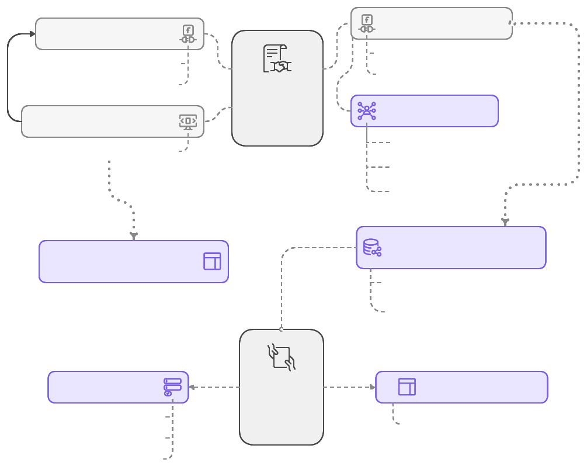
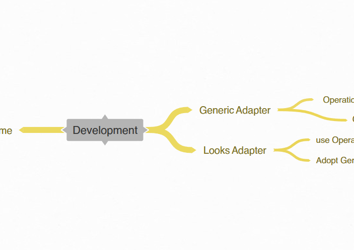

  

# The OpenAPI Design-by-Contract Suite

<small>`#typescript` `#nodejs` `#openapi` `#contract` `#backend` `#front-end` `#documentation`</small>

**Contents**

- [Design by Contract](#design-by-contract)
  - [The Suite Goal](#the-suite-goal)
  - [The DbC Process](#the-dbc-process)
    - [Code-Contract Co-Design](#code-contract-co-design)
      - [The Solution](#the-solution)
- [The Basic Motivation](#the-basic-motivation)
- [The Big Picture](#the-big-picture)
- [The Packages](#the-packages)
- [Operations](#operations)
  - [Development](#development)
    - [Tooling](#tooling)
    - [The Repository Structure](#the-repository-structure)
  - [CI/CD](#cicd)
    - [Composed Git Workflows](#composed-git-workflows)

## Design by Contract

**IMPORTANT**: The Suite provides the tools to implement [Design-by-Contract](https://en.wikipedia.org/wiki/Design_by_contract) (**DbC**, [^1]) along the entire workflow of a software product creation.

### The Suite Goal

To provide a smooth Contract design, living documentation, construction and enforcement tools. OAS is a core of this. But the process asks for convenience and smoothness to become really productive.

What it should look like:

- design (write) the Contract as _modular_ OAS definitions;
- see the live documentation site as you write the definitions;
- be able to continuously publish the Contract documentation;
- be able to package Contract with its enforcement tools to apply it at consumers;

---

The former version of goals

- Definition and implementation phases: deliver convenient and flexible Contract documentation website (Looks Package);
- All three phases: provide Contract enforcement tools (Contract Outlet);

> TBW. this is just a draft. it will show itself with the time.

The packages in the repository aim to provide tools to implement Design-by-Contract in NodeJS/TypeScript environments.

- Create contracts: external packages to be used; Not sure if I have to describe it further here or at all;
- Use contracts: OAS Contract Adapters: generic, Concrete Contract Outlet Generator;
- Present: OAS Contract Looks;

### The DbC Process

The entire DbC process undergoes 3 phases: the concrete Contract design (definition), construction (Contract realization in code) and application (consume Contract by other code). First two alternate between each other until the Contract stabilizes.

The design is defined with OpenAPI specification. The construction and application require the common tools (frameworks, packages etc.) and specific **DbC** tools to provide Contract documentation and enforcement.

#### Code-Contract Co-Design

Along other projects design the necessity to design code simultaneously with APIs contract revealed.

What I observed:

- To design the Contract for the concrete endpoint you inevitably have to deeper understand the product requirements to model the data and the behavior of the endpoint. This understanding just begs to be documented nearby the endpoint documentation.

- At present OAS does not allow to conveniently (modular, managed separately, presented together) write the extensive code design descriptions;

- The possibility to document the details right away would immensely contribute to the ease of programming and the quality of product.

More formally now:

In DbC approach when designing an application API contract, it feels natural to document requirements, endpoint behavior, critical subtleties, code design rationale, and alternative solutions. Being able to do this would ensure robust contract design and support effective software construction.

Keeping the API contract and code design notes together would further strengthen the contract as a single source of truth. It would also critically strengthen the Contract as a living documentation by enriching it with requirements, rationale, and solutions.

##### The Solution

The small and very effective solution here could be a CLI package that allows merging the separate `.md` files located nearby the OAS contract into OAS `description` fields. It can be easily introduced into the OAS Contract build pipelines.

## The Basic Motivation

Initially I needed the versatile and flexible OpenAPI documentation website tool that could be modular and easily adaptable to show the concrete OpenAPI contracts in a human-readable form. I.e. a website.

The existing solutions were either not flexible enough to adopt my functional and visual design requirements or paid.

Starting from that idea I am on the way to create better solution as I see it.

## The Big Picture

> TBW. this is just a draft. it will show itself with the time.

Contract Outlet Adapter is used as a standalone package in the Concrete contract definition repositories. It should be provided with OAS JSON definitions to generated the Concrete Contract Outlet adapter. The generated adapter then is imported in the backend or front-ends like Fastify or Vue applications.

The Concrete Contract Outlet adapter is used in backends to create the endpoints (taking verbs, routes) and validate request and response. On front-ends the Outlet is used to organize the inputs validation with packages like `ajv`.

  

[^1]: For people new to DbC approach on top of the above mentioned [wiki](https://en.wikipedia.org/wiki/Design_by_contract) link here are some useful links to start from. Stoplight Blog [API-First vs. API Design-First: A Comprehensive Guide](https://blog.stoplight.io/api-first-vs-api-design-first-a-comprehensive-guide), Contract-First Development Internet search [results](https://duckduckgo.com/?q=Contract-First+Development).

## The Packages

- [Generic OAS Adapter](packages/adapters/generic);
- [Contract Outlet Adapter](packages/adapters/outlet);
- [Looks](packages/looks);
  + [Theme](packages/looks);
  + [Adapter](packages/looks);
  So far Looks Adapter and Looks Theme are under implicit development as the entire Looks package. They will be extracted into the dedicated packages as soon as they reveal themselves.
- [Utilities](packages/utilities);
  + [Markdown Merger](packages/utilities/markdown-merger)

## Operations

### Development

<a href="https://coggle.it/diagram/ZzrasnH5wJ7yTWod/t/oas/37c1aa8d2048f33deaada3bf2dba0cf80cd8137497bd005b025507e8ce35a2a9">
  
Development Plan Overview

  
</a>

#### Tooling

TypeScript, NodeJS, Vitest.

#### The Repository Structure

The repository is a monorepo (using `npm workspaces`) with independent packages deployment.

The monorepo root only serves as the common packages and scripts storage as well as centralized documentation (where appropriate) and GitHub side matters (issues, projects, merges etc.).

Each actual package is developed, built and deployed independently. When the monorepo package depends on its siblings it manages the dependency on its own.

### CI/CD

The process enforces quality via automated tests, commit messages rules, release rules and IaC scripts.

#### Composed Git Workflows

The packages within Suite with the time will implement my [Composed Git Workflow](https://github.com/progressing-explorations/shared/tree/master/composed-git-workflows#composed-git-workflows).

Specifically it will include the daily development management and release management.
