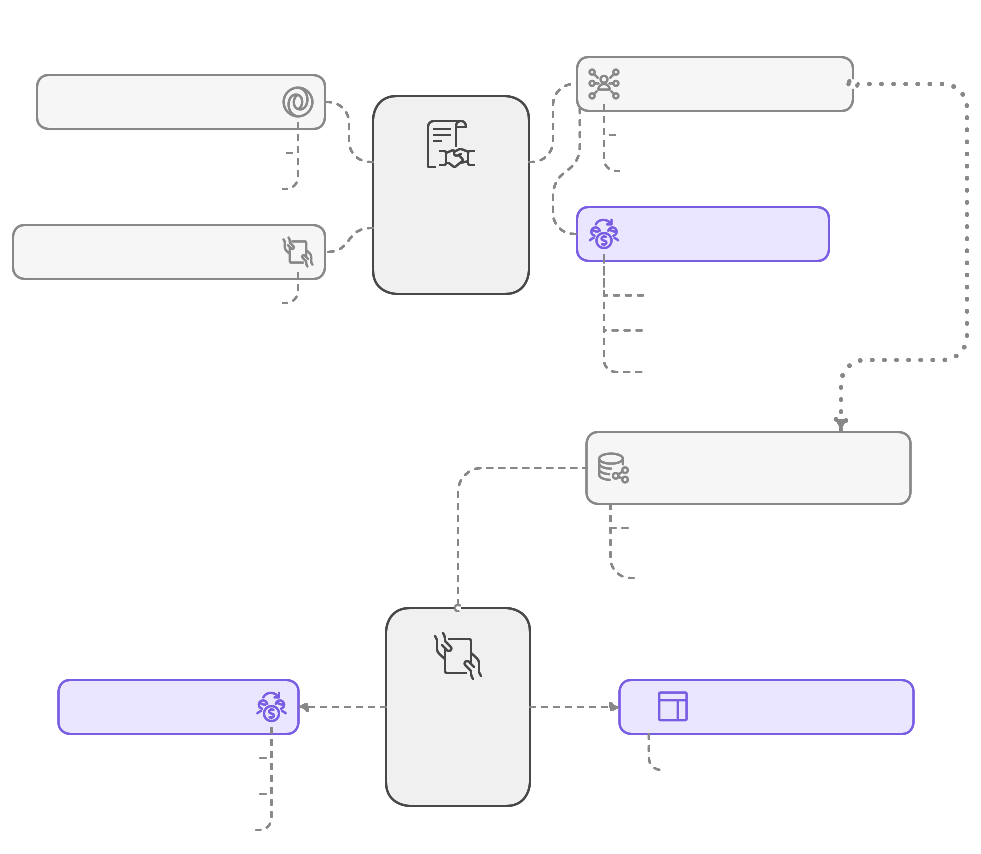

# The OAS Contract Packages

TBW later.

Goal: provide tools to implement Design-by-Contract in NodeJS/TypeScript environment.

- Present: OAS Contract Looks
- Use: OAS Contract Adapters: generic, contract outlet (with generator)
- Create: external packages to be used;

Generic Adapter is used by Looks application to create the contract documentation. Generic Adapter takes the OAS JSON definitions and provides the standardized interface for consumers like Looks application.

  

