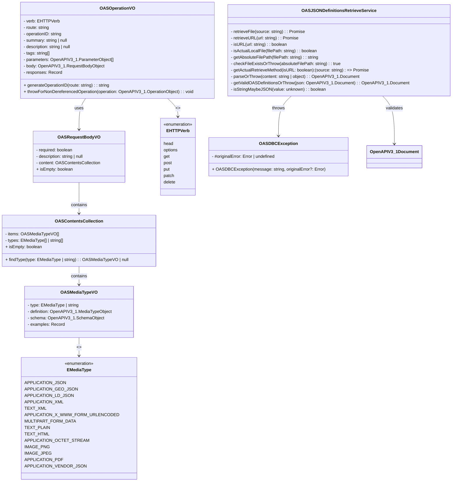

```mermaid
classDiagram
    class OASDBCException {
        - #originalError: Error | undefined
        + OASDBCException(message: string, originalError?: Error)
    }

    class EHTTPVerb {
        <<enumeration>>
        head
        options
        get
        post
        put
        patch
        delete
    }

    class EMediaType {
        <<enumeration>>
        APPLICATION_JSON
        APPLICATION_GEO_JSON
        APPLICATION_LD_JSON
        APPLICATION_XML
        TEXT_XML
        APPLICATION_X_WWW_FORM_URLENCODED
        MULTIPART_FORM_DATA
        TEXT_PLAIN
        TEXT_HTML
        APPLICATION_OCTET_STREAM
        IMAGE_PNG
        IMAGE_JPEG
        APPLICATION_PDF
        APPLICATION_VENDOR_JSON
    }

    class OASOperationVO {
        - verb: EHTTPVerb
        - route: string
        - operationID: string
        - summary: string | null
        - description: string | null
        - tags: string[]
        - parameters: OpenAPIV3_1.ParameterObject[]
        - body: OpenAPIV3_1.RequestBodyObject
        - responses: Record<string, OpenAPIV3_1.ResponseObject>
        + generateOperationID(route: string): string
        + throwForNonDereferencedOperation(operation: OpenAPIV3_1.OperationObject): void
    }

    class OASRequestBodyVO {
        - required: boolean
        - description: string | null
        - content: OASContentsCollection
        + isEmpty: boolean
    }

    class OASContentsCollection {
        - items: OASMediaTypeVO[]
        - types: EMediaType[] | string[]
        + isEmpty: boolean
        + findType(type: EMediaType | string): OASMediaTypeVO | null
    }

    class OASMediaTypeVO {
        - type: EMediaType | string
        - definition: OpenAPIV3_1.MediaTypeObject
        - schema: OpenAPIV3_1.SchemaObject
        - examples: Record<string, OpenAPIV3_1.ExampleObject>
    }

    class OASJSONDefinitionsRetrieveService {
        - retrieveFile(source: string): Promise<string>
        - retrieveURL(url: string): Promise<string>
        - isURL(url: string): boolean
        - isActualLocalFile(filePath: string): boolean
        - getAbsoluteFilePath(filePath: string): string
        - checkFileExistsOrThrow(absoluteFilePath: string): true
        - getActualRetrieveMethod(isURL: boolean): (source: string) => Promise<string>
        - parseOrThrow(content: string | object): OpenAPIV3_1.Document
        - getValidOASDefinitionsOrThrow(json: OpenAPIV3_1.Document): OpenAPIV3_1.Document
        - isStringMaybeJSON(value: unknown): boolean
    }

    OASOperationVO --> OASRequestBodyVO : uses
    OASRequestBodyVO --> OASContentsCollection : contains
    OASContentsCollection --> OASMediaTypeVO : contains
    OASMediaTypeVO --> EMediaType : <<enumeration>>
    OASOperationVO --> EHTTPVerb : <<enumeration>>
    OASJSONDefinitionsRetrieveService --> OASDBCException : throws
    OASJSONDefinitionsRetrieveService --> OpenAPIV3_1Document : validates
```