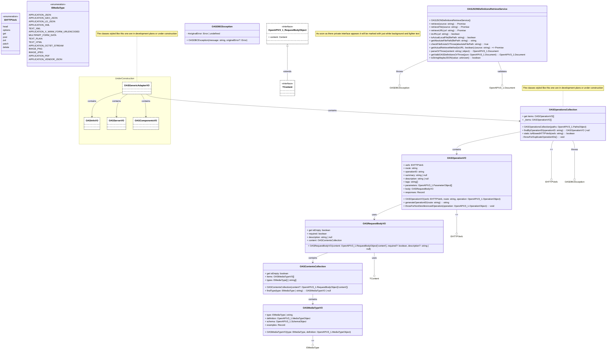

```mermaid
classDiagram

    namespace Under Construction {
        class OASGenericAdapterVO
        class OASInfoVO
        class OASServerVO
        class OASComponentsVO
    }

    style OASGenericAdapterVO fill:#fff,stroke:#888,stroke-width:2px,color:#000,stroke-dasharray: 5 5;
    style OASInfoVO fill:#fff,stroke:#888,stroke-width:2px,color:#000,stroke-dasharray: 5 5;
    style OASServerVO fill:#fff,stroke:#888,stroke-width:2px,color:#000,stroke-dasharray: 5 5;
    style OASComponentsVO fill:#fff,stroke:#888,stroke-width:2px,color:#000,stroke-dasharray: 5 5;

    OASGenericAdapterVO --> OASInfoVO : contains
    OASGenericAdapterVO --> OASServerVO : contains
    OASGenericAdapterVO --> OASOperationsCollection : contains
    OASGenericAdapterVO --> OASComponentsVO : contains
    
    note "As soon as there private interface appears it will be marked with just white background and lighter text"

    note for OASGenericAdapterVO "The classes styled like this one are in development plans or under construction"
    note for OASOperationsCollection "The classes styled like this one are in development plans or under construction"

    class EHTTPVerb {
        <<enumeration>>
        head
        options
        get
        post
        put
        patch
        delete
    }

    class EMediaType {
        <<enumeration>>
        APPLICATION_JSON
        APPLICATION_GEO_JSON
        APPLICATION_LD_JSON
        APPLICATION_XML
        TEXT_XML
        APPLICATION_X_WWW_FORM_URLENCODED
        MULTIPART_FORM_DATA
        TEXT_PLAIN
        TEXT_HTML
        APPLICATION_OCTET_STREAM
        IMAGE_PNG
        IMAGE_JPEG
        APPLICATION_PDF
        APPLICATION_VENDOR_JSON
    }

    class OpenAPIV3_1_RequestBodyObject {
        <<interface>>
        + content: Content
    }

    class TContent {
        <<interface>>
    }

    style OpenAPIV3_1_RequestBodyObject fill:#fff,stroke:#888,stroke-width:2px,color:#000,stroke-dasharray: 5 5;
    style TContent fill:#fff,stroke:#888,stroke-width:2px,color:#000,stroke-dasharray: 5 5;

    OpenAPIV3_1_RequestBodyObject <|-- TContent : extends
    OASRequestBodyVO --() TContent : uses

    class OASDBCException {
        + OASDBCException(message: string, originalError?: Error)
        - #originalError: Error | undefined
    }

    class OASOperationVO {
        + OASOperationVO(verb: EHTTPVerb, route: string, operation: OpenAPIV3_1.OperationObject)
        + generateOperationID(route: string): string
        + throwForNonDereferencedOperation(operation: OpenAPIV3_1.OperationObject): void
        + verb: EHTTPVerb
        + route: string
        + operationID: string
        + summary: string | null
        + description: string | null
        + tags: string[]
        + parameters: OpenAPIV3_1.ParameterObject[]
        + body: OASRequestBodyVO
        + responses: Record<string, OpenAPIV3_1.ResponseObject>
    }

    class OASRequestBodyVO {
        + OASRequestBodyVO(content: OpenAPIV3_1.RequestBodyObject['content'], required?: boolean, description?: string | null)
        + get isEmpty: boolean
        + required: boolean
        + description: string | null
        + content: OASContentsCollection

    }

    class OASContentsCollection {
        + OASContentsCollection(content?: OpenAPIV3_1.RequestBodyObject['content'])
        + get isEmpty: boolean
        + findType(type: EMediaType | string): OASMediaTypeVO | null
        + items: OASMediaTypeVO[]
        + types: EMediaType[] | string[]
    }

    class OASMediaTypeVO {
        + OASMediaTypeVO(type: EMediaType, definition: OpenAPIV3_1.MediaTypeObject)
        + type: EMediaType | string
        + definition: OpenAPIV3_1.MediaTypeObject
        + schema: OpenAPIV3_1.SchemaObject
        + examples: Record<string, OpenAPIV3_1.ExampleObject>
    }

    class OASJSONDefinitionsRetrieveService {
        + OASJSONDefinitionsRetrieveService()
        + retrieve(source: string): Promise<OpenAPIV3_1.Document>
        + retrieveFile(source: string): Promise<string>
        + retrieveURL(url: string): Promise<string>
        + isURL(url: string): boolean
        + isActualLocalFile(filePath: string): boolean
        + getAbsoluteFilePath(filePath: string): string
        + checkFileExistsOrThrow(absoluteFilePath: string): true
        + getActualRetrieveMethod(isURL: boolean): (source: string) => Promise<string>
        + parseOrThrow(content: string | object): OpenAPIV3_1.Document
        + getValidOASDefinitionsOrThrow(json: OpenAPIV3_1.Document): OpenAPIV3_1.Document
        + isStringMaybeJSON(value: unknown): boolean
    }

    class OASOperationsCollection {
        + OASOperationsCollection(paths: OpenAPIV3_1.PathsObject)
        + get items: OASOperationVO[]
        + findByOperationID(operationID: string): OASOperationVO | null
        + static isAllowedHTTPVerb(verb: string): boolean
        + _items: OASOperationVO[]
        - throwForDuplicateOperationIDs(): void
    }

    OASOperationVO --> OASRequestBodyVO : uses
    OASRequestBodyVO --> OASContentsCollection : contains
    OASContentsCollection --> OASMediaTypeVO : contains
    OASMediaTypeVO --() EMediaType : <<enumeration>>
    OASOperationVO --() EHTTPVerb : <<enumeration>>
    OASJSONDefinitionsRetrieveService --() OASDBCException : throws
    OASJSONDefinitionsRetrieveService --() OpenAPIV3_1.Document : validates
    OASOperationsCollection --> OASOperationVO : contains
    OASOperationsCollection --() EHTTPVerb : <<enumeration>>
    OASOperationsCollection --() OASDBCException : throws

```
