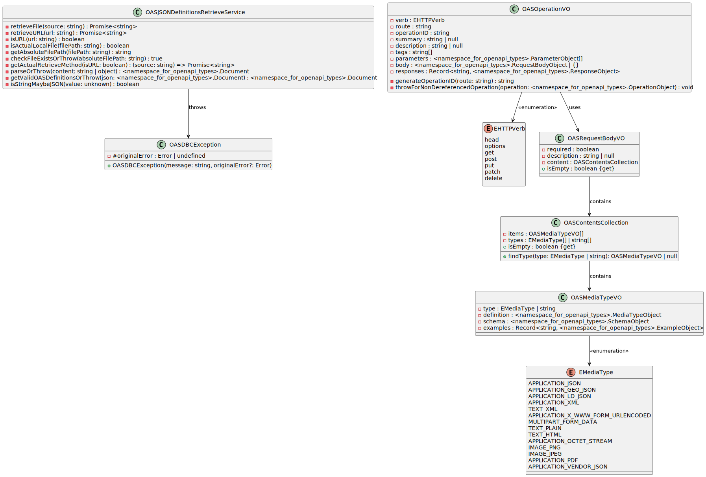

## The OAS DbC Generic Adapter Package

### Meaning & Naming 

`OASGenericAdapter` does convey the intended meaning that it is a programmatic object wrapper designed to serve as an intermediary between OpenAPI Specification (OAS) JSON definitions and the consumer. Here's how it communicates that:

- OAS: Clearly indicates that the adapter is related to OpenAPI Specifications, making it evident what type of definitions it works with.
- Generic: Suggests that the adapter is versatile and can handle a range of use cases, which aligns with your intention of it being universal.
- Adapter: Implies that it serves to bridge the gap between the OAS definitions and the consumers, transforming or facilitating interaction with the underlying data.

### Documenting

UML Class Diagram

<div align="center">
  
</div>


### Publish Package

To publish the package to the specific registry other than `npmjs` <u>from the build folder</u> with the npm scripts like

```bash
"package:publish": "cd ./.delivery/.builds/dist && npm publish"
```

the `npm publish` command has to find the `.npmrc` file. Thus it is  mandatory the to set the respective env variable to for the `.npmrc` file to be found. 

```bash
# Linux bash
export NPM_CONFIG_USERCONFIG=/path/to/custom/.npmrc
# Windows PowerShell
$env:NPM_CONFIG_USERCONFIG="<the-full-actual-path-to-repository-root>\.npmrc"
```

The `package.json` `publishConfig` key is mostly for an information in this case.

```json
    "publishConfig": {
        "registry": "https://npm.pkg.github.com"
    },
```

### Testing

The good [source](https://github.com/readmeio/oas-examples) of OAS 3.1 JSON definitions examples. The [dereferenced](https://editor-next.swagger.io/) (references resolved) petstore [fixture](./tests/foundation/.ancillary/fixtures/definitions/petstore.oas.json) used in tests is taken from there.