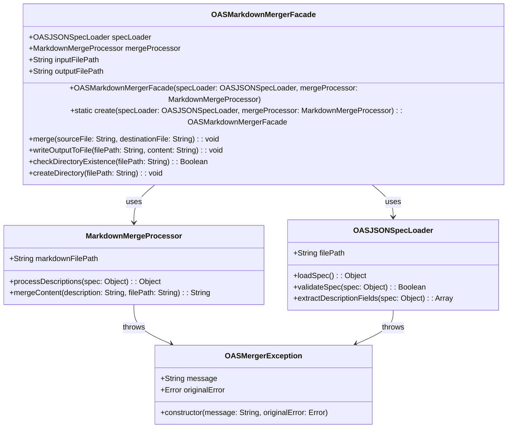

```mermaid
classDiagram
    class OASMarkdownMergerFacade {
        +OASJSONSpecLoader specLoader
        +MarkdownMergeProcessor mergeProcessor
        +String inputFilePath
        +String outputFilePath
        +OASMarkdownMergerFacade(specLoader: OASJSONSpecLoader, mergeProcessor: MarkdownMergeProcessor)
        +static create(specLoader: OASJSONSpecLoader, mergeProcessor: MarkdownMergeProcessor): OASMarkdownMergerFacade
        +merge(sourceFile: String, destinationFile: String): void
        +writeOutputToFile(filePath: String, content: String): void
        +checkDirectoryExistence(filePath: String): Boolean
        +createDirectory(filePath: String): void
    }
    
    class OASJSONSpecLoader {
        +String filePath
        +loadSpec(): Object
        +validateSpec(spec: Object): Boolean
        +extractDescriptionFields(spec: Object): Array
    }

    class MarkdownMergeProcessor {
        +String markdownFilePath
        +processDescriptions(spec: Object): Object
        +mergeContent(description: String, filePath: String): String
    }

    class OASMergerException {
        +String message
        +Error originalError
        +constructor(message: String, originalError: Error)
    }

    OASMarkdownMergerFacade --> OASJSONSpecLoader : uses
    OASMarkdownMergerFacade --> MarkdownMergeProcessor : uses
    MarkdownMergeProcessor --> OASMergerException : throws
    OASJSONSpecLoader --> OASMergerException : throws

```