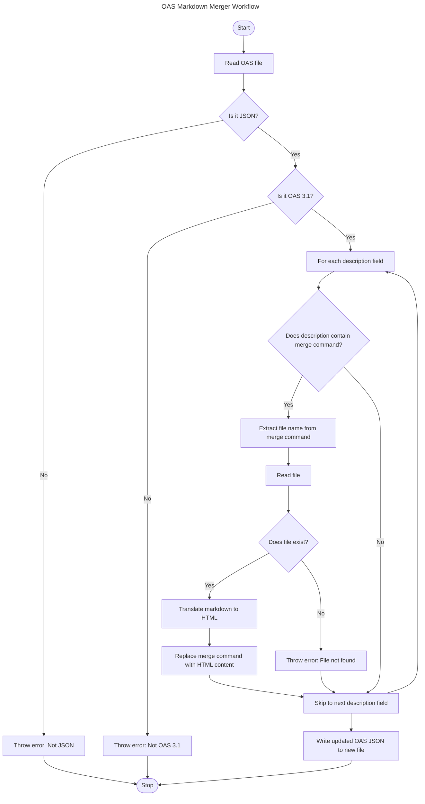

```mermaid
---
title: OAS Markdown Merger Workflow
---

flowchart TD
  Start([Start])
  Stop([Stop])
  
  Start --> A[Read OAS file]
  A --> B{Is it JSON?}
  B -->|Yes| C{Is it OAS 3.1?}
  B -->|No| M[Throw error: Not JSON] --> Stop
  C -->|Yes| E[For each description field]
  C -->|No| F[Throw error: Not OAS 3.1] --> Stop
  E --> G{Does description contain merge command?}
  G -->|Yes| H[Extract file name from merge command]
  H --> I[Read file]
  I --> J{Does file exist?}
  J -->|Yes| L1[Translate markdown to HTML]
  L1 --> K[Replace merge command with HTML content]
  K --> M1[Continue to next description field]
  J -->|No| L[Throw error: File not found]
  L --> M1
  G -->|No| M1[Skip to next description field]
  M1 --> E
  M1 --> N[Write updated OAS JSON to new file]
  N --> Stop
```